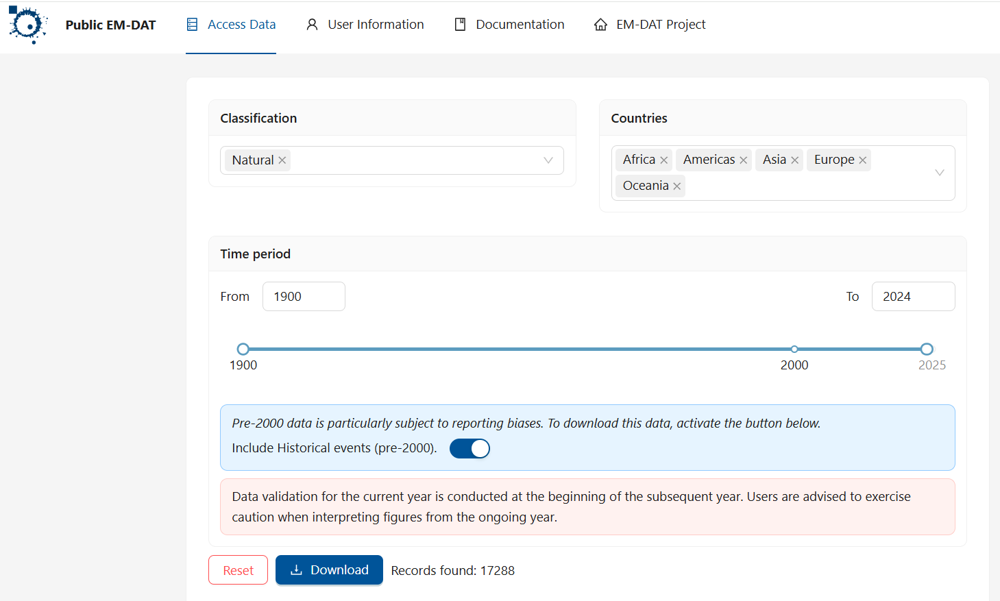
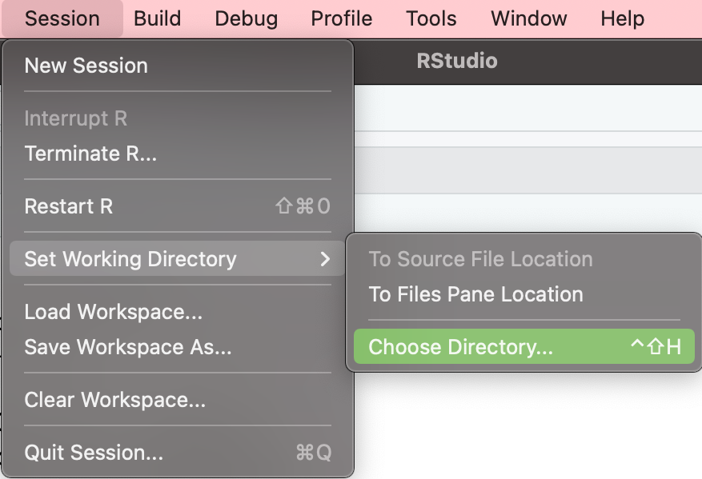
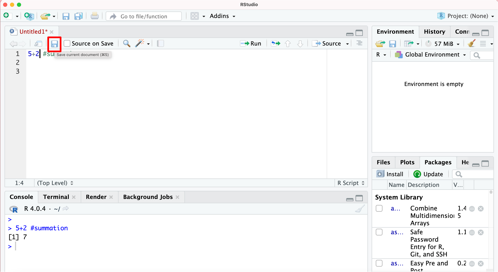
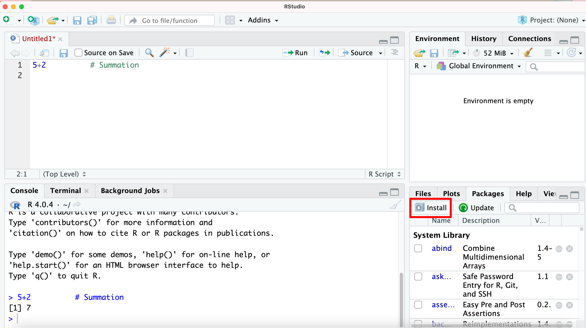
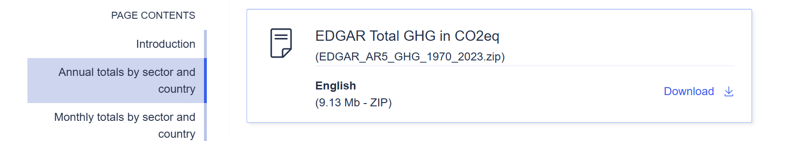
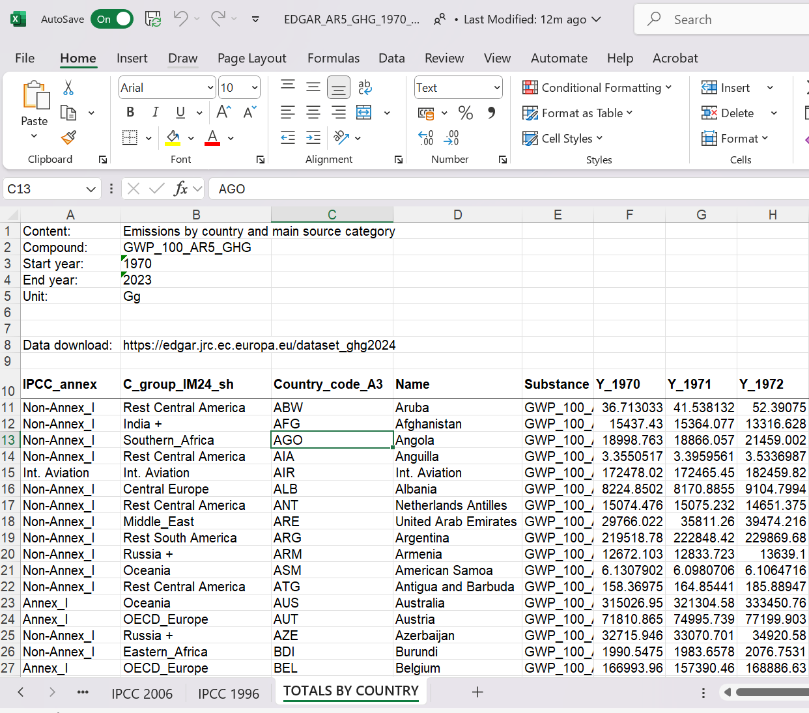

```{r setup, include = FALSE}
knitr::opts_chunk$set(echo = TRUE, message=FALSE, warning = FALSE)
library(webexercises)
```


```{r, echo = FALSE, results='asis'}
# Uncomment to change widget colours:
#style_widgets(incorrect = "goldenrod", correct = "purple")
```

# Aim

In this workthrough you will be exposed to some of the most basic, but also most relevant (and sometimes challenging) tasks in data analysis. In particular we will be using real-life data to understand whether natural disasters are becoming more frequent (potentially due to climate change) and whether the increased frequencies of these affects dis proportionally those countries that actually contributed least to climate change.

This is written as if you have never been esposed to coding in R (or any other language). If you have, then lots of the initial sections will look very familiar to you. But this workthrough is also not meant to be a training guide to all the things we do. It is meant as an indication of what is possible and a demonstration of how data analysts actually work. 

Importantly, this walkthrough will also show some of the unglamorous tasks of an applied economist/data scientist, such as dealing with error messages and finding out how to solve coding issues.


# Preparing your workspace

Before you do each task, you need to prepare your workspace first. Here we assume that you have successfully installed first R and then RStudio.

**Step 1**. **Create a folder.** 

Create a folder called **`RWork`** on your computer. Remember where this folder is located on your computer (you will need the entire path to that folder later).

<br>

**Step 2**. **Download the data and save it in the `RWork` folder**

We shall use data from a database of disasters (natural or technical, although we will focus on natural disasters). This database is maintained by [The Centre for Research on the Epidemiology of Disasters (CRED)](https://www.emdat.be/). Go to the website and click on "Access the data" and follow the registration instructions. Use your university email and indicate that you are accessing the data from an academic institution. This will give you access to the data. After confirming your registration from your email account you will get to a data download screen and you should use the following settings (note that you should choose the data between 1900-2024):

{width="50%"}

After clicking download you should find that an EXCEL workshet was downloaded. Make sure you give this worksheet a sensible name. On this occasion I named it **`"natural.xlsx"`** and, importantly, **save it in the RWork folder you created in step 1**.

<br>

**Step 3**. **Open R and set your working directory.**

We will be loading these data (information on more than 17,000 disasters) into RStudio and then perform some exploratory data analysis. For this to happen we will have to instruct R to load this data. But before we do that it is useful to let R know which folder we wish to work from. Of course it will be our **`RWork`** folder we created in the Step 1.

-   **Option 1.** Set Working Directory via RStudio Menu Bar

Menu bar → Click **`Session`** → **`Set Working Directory`** → **`Choose Directory`** → Select **`RWork`** folder you created in step 1

{width="400"}

-   **Option 2.** Set Working Directory with Code `setwd()`

Alternatively, you can set the working directory through code. This is where you need to know the entire path of your folder. The command used to set the working directory is `setwd()`.

**Example**. Suppose I create a folder called RWork on my desktop, and select folder RWork when set working directly, here are the codes for different type of users.

```{r message=FALSE, warning=FALSE, results='hide',eval=FALSE}
setwd("~/Desktop/RWork")                          # for Mac users
setwd("C:/RWork")                                 # for Windows users
```

This is an example. You may have given your directory a different name. You should replace the actual path with the path leading to your folder. Always use "/" (forward slash) even if on your computer folders may be separated by a backward slash.

After executing this line of code (CTRL + ENTER on Windows, CMD + ENTER on Macs, or clicking on the run while your cursor is in the line) button you are ready to get data into the software.

<br>

**Step 4.** **Open an R script file before you start with your analysis.**

Click on the little white sheet with the white plus over a green circle to open an R script:

{width="300"}

R script file is just a **text file**, which can help us to save codes.

<br>

**Step 5.** **Type the code in the R script file.**

Somewhere underneath, into your script, type the line below. Then have your cursor in that line and either press the run button or type CTRL + ENTER (or COMMAND + ENTER on a Mac).

```{r message=FALSE, warning=FALSE, results='hide',error=TRUE}
5+2       # Summation     
```

Here, R has calculated 5+2 and give you the result 7. Also note that the text after "#" is a comment and will be ignored by R.

`r hide("Why should I write comments?")`

There are a number of reasons why you should be adding comments to your code. By far the most important is to communicate with your future self. Imagine you are writing code for a project which has a deadline in three weeks. However, you will have to interrupt the exciting data work for a week to finish an essay. When you return to your code in a week time you will have forgotten why you did certain things. Unless, you have added sufficient comments to your code explaining to your future self why you did certain things.

Do add comments liberally.

`r unhide()`

```{r}
a <- sqrt(5677170409)
```

You have just created a new variable, called `a` and the value this variable has taken is the $\sqrt{5677170409}=75347$ and you should be able to see that variable listed in the Environment tab (top right). So far this is really not much more than a calculator (with a function to save results).

You can now use the variable `a` in a new calculation. In the next line type

```{r}
b <- exp(a-76*1000)
```

You should find that the variable `b` is now a very small, but positive number. By the way, R is case sensitive, if you try to enter `b <- exp(A-76*1000)` you should get an error message (Error: object 'A' not found) in the Console as R doesn't know what `A` is.


`r hide("What is the Console?")`

Whenever you executed a line of code you will have seen that line of code copied in the Console (typically visible in the lower left hand corner of your RStudio screen). If the code you have executed produces any result to print (like when you calculated `5+2`) the result will also be shown. In fact you could type lines of code straight into the Console and press ENTER to execute a line. And in fact you will do that often, especially if you just want to check or try something.

The Console is also the place where you will see error messages displayed. You are sort of communicating with R via the Console.

**BUT**, if you close RStudio and then re-open it the next day, then everything you typed into the Console will be lost. Yes, gone. Just imagine the two hours of work you did to create some amazing analysis and beautiful plots, gone. Therefore all lines of code that contribute to your data work and you may want to repeat have to be in the script file. Everything you put into a script and saved will still be there the next time you open that script file. And by clicking the **`Source`** button R will automatically execute your entire analysis.

`r unhide()`


<br>

**Step 6.** **Save your work as an R script**

Save the file in .R format. The R script will contain all your commands you have used in the current session and allows you to replicate what we have done in the future.

Click the disk icon. In the new window, name the R script file and save it in the folder you created in the step 1 (e.g. RWork).


These scripts are like a written recipe of your work which allows you to reproduce your work. If you use R scripts, you do not have to save your workspace image. 

<br>


**Revision question**

Which of the following is **not** good practice (and you will regret doing it)?

`r mcq(c("Create a working directory in which I save all data and script files", "Save all important code into a R script file", answer =  "Work mainly in the Console as it is the easiest", "Add comments to your code"))` 
<br>

# Task 1. Installing and Loading R Packages.

The R software comes with a lot of functionality as you download it to your computer. As it is an open-source software, anyone can add functionality to R. This added functionality come in batches of code that are called "packages". To use any of this added functionality, you first need to install the relevant package and then activate (or load) it into your session. Once the package is activated, you can access and use the functions it contains.

For instance, if we intend to use the `read_excel()` function for importing Excel data in R, it's essential to note that `read_excel()` is stored in a package called **`readxl`**

Therefore, to make use of `read_excel()`, you must first install and activate the `readxl` package. Once activated, you will have access to the "read_excel" function within the `readxl` package for data importation.

<br>

Two ways to **install** packages in R.

1.  Use package window

The easiest way to install packages is through the RStudio package window (that's the pane in the bottom right corner of the screenshot below).

Click on the Packages tab and you will see all the packages that are already installed. To activate them, tick the box next to the package name.

If the required package is not there, you can install it via the Install tab. In the newly opened window, just type in the R package name and click 'install'. To update the installed R packages click on the Update tab that is just next to the Install tab.



2.  Use code

You can also use the command line to install, activate and update packages. Assume you want to install the R-package **`readxl`**:

```{r message=FALSE, warning=FALSE, results='hide',eval=FALSE}
install.packages("readxl") 
```

A package only needs installing once on your computer. It is for this reason that there is no need to save the `install.packages("readxl") ` code in your script.

After the installation we **activate/load** the package with:

```{r}
library(readxl)
```

This needs doing everytime you load your script and therefore the `library("readxl")` should be saved in your script.

**Key point:**

Install package: just do **once**

Activate package: do it **every time you need**

This means that you have installed the **`readxl`** package this time. In future instances, there is no need to reinstall it. However, you will need to activate it by typing the command `library(readxl)` every time you want to use the `read_excel()` function stored in it.

<br>

We will also use functionality of the `tidyverse` and `ggplot2` packages. In case you have not yet installed these packages on your computer you can install these with the following command:

`install.packages(c("tidyverse", "ggplot2")) ` `r torf(TRUE)`

Once these two packages are installed, activate/load them in your code. **For each task, replace the missing part XXXX to make these codes work.**

```{r, echo = FALSE}
library(tidyverse)
library(ggplot2)
```

```{r, eval = FALSE}
library(XXXX)
XXXX(XXXX)
```

<br>

# Task 2. Import the Excel data set into R.
Once the readxl library is activated, we can use its `read_excel()` function to import the **`"natural.xlsx"`** dataset. We then store the imported dataset in an object named `emdat`.

```{r}
emdat <- read_excel("natural.xlsx", guess_max = 15000) 
# for now ignore what guess_max = 15000 does) 
```


`r hide("What does this line of code actually do")`

It is extremely important to be able to read code and understand what it does. This is especially true in a world where we increasingly do not have to write code from scratch but have helpers at our hand that deliver code. But you need to remember that you are the quality control and are responsible for the code doing what you want it to do.

Here we are again using the assignment operator `<-` which tells R to define a new object, here `emdat`, with whatever is on the right hand side of the assignment operator. On the right and side we are using the `read_excel` function. Functions are the bread and butter of working in R. Hidden behind `read_excel` is a lot of code that achieves a articular purpose. Usually that code needs some input variable(s). These input variables are delivered in the parentheses directly after the function name. How many and what inputs are needed depends on the function. You can find details on that if you call the help function. Here you would type `?read_excel` into the console and the help text will appear in the Help console (typically in the bottom right of your RStudio screen).

The first input is the path to the EXCEL file we wish to import. Note that the default path used is the working directory we set previously. As we saved the datasheet into that directory we only need to give the file name. The function does take that EXCEL file and converts it into a dataframe (think about it as the equivalent of a spreadsheet in R) which then can be used in R. Once you executed this line you should see `emdat` in the environment tab. 

What does the second input (`guess_max = 15000`) actually do? (More detail on that later)


```{r, echo =FALSE}
opts_re1 <- c(
   "Sets the maximum number of milliseconds R should take to guess the variable types",
   "Sets the maximum number of rows to be imported",
   "Determines that missing data should be replaced with random numbers between 1 and 15000",
   answer = "Sets the maximum number of data rows to use for guessing column types."
)
```

`r longmcq(opts_re1)`

While the purpose of this may still be a little murky, the help function should give you enough information to answer the question.

`r unhide()`

You can immediately see from the Environment tab that the object has 17,288 observations (or rows) and `r fitb(46, num = TRUE)` variables (or columns).

If you click on the little spreadsheet symbol in the `accdata` line in the environment you can actually see the spreadsheet. It should look a little like this

```{r,echo=FALSE}
head(emdat)
```

It is often useful to find out what sort of variables are contained in the dataset. There are two useful commands.

```{r}
names(emdat)
str(emdat)
```

The `str` command doesn't only give you a list of variable names but also gives you the variable type. The first variable (`DisNo`) is of type `chr` which is basically a text or character variable. It is a unique identifier for a disaster. Most variables are of type `chr` or `num`, which stands for numerical variables. Data types are important as there are some things you cannot do with certain variable types. For instance you couldn't multiply `chr` variables as multiplication with text is not defined.

`r hide("Why was using guess_max = 15000 important?")`

When importing data we used the option "guess_max = 15000". You are now in a position to understand what this option does. Rerun the import command above with that option switched off (i.e. deleting it) and see whether you can see a difference in the variable types. By default R will use the first 1000 entries of a variable to guess what the best datatype is. Here the first 1000 observations are all very old disasters and for some variables (like reconstruction costs) all these observations are missing (NA). That means that R cannot guess a good data type from these initial 1000 observations. To allow R to guess the right datatype we will force R to guess the datatype from the first 15000 rows. It is for this reason that it is super useful to look at the datatypes and confirm that they are the data types we expect.

`r unhide()`

There is another small issue which is best fixed at the beginning. As we walk through our project we will need to address particular variables. When variable names have spaces in them, this becomes just a little bit more annoying in R and hence we apply the following line.

```{r}
names(emdat) <- make.names(names(emdat))
```


Check out what this line did and once you see the difference, try and understand how the above line achieved this.

`r hide("How do I check this out?")`

Understanding what particular lines of code do is super important. There are three ways to do that.

1. You know that it does something to the names of the variables in `emdat`. So look at the names before you run that line (run `names(emdat)` in the Console) and look at the names again after you run the line above. You should see the difference. (this is really the best way to start)
2. You call up the help for the `make.names` function and read through the info (run `?make.names` in the Console)
3. You copy the line of code into a LLM and ask it what it does.

`r unhide()`

Some of the variable names are very long and it may be useful to shorten them.

```{r}
names(emdat)[names(emdat) == "AID.Contribution...000.US.."] <- "AID.Contr"
names(emdat)[names(emdat) == "Reconstruction.Costs...000.US.."] <- "Rec.Cost"
names(emdat)[names(emdat) == "Reconstruction.Costs..Adjusted...000.US.."] <- "Rec.Cost.adj"
names(emdat)[names(emdat) == "Insured.Damage...000.US.."] <- "Ins.Damage"
names(emdat)[names(emdat) == "Insured.Damage..Adjusted...000.US.."] <- "Ins.Damage.adj"
names(emdat)[names(emdat) == "Total.Damage...000.US.."] <- "Total.Damage"
names(emdat)[names(emdat) == "Total.Damage..Adjusted...000.US.."] <- "Total.Damage.adj"
```

`r hide("What do these lines do?")`

Let's look at a particular example here:

```{r, eval = FALSE}
names(emdat)[names(emdat) == "AID.Contribution...000.US.."] <- "AID.Contr"
```

You should always first find the assignment operator `<-`. What is on the right of this, here the text "AID.Contr" will be put into the place indicated on the left hand side. In this example we are not creating a new object on the left hand side, but we are replacing a value of an object that already exists.

That object that exists is `names(emdat)`. That by itself is the list of column names in `emdat`. But in this line we do not want the whole list of 46 variable names being replaced with just one name, but  rather we wish to replace a particular one with "AID.Contr", leaving the other 45 unchanged. So how do we tell R which of the 46 names we want changed? This is what happens inside the square brackets. There we call `names(emdat) == "AID.Contribution...000.US.."`, it is basically saying that we should replace that variable name that currently is set to "AID.Contribution...000.US..". 

Formally this happens by creating a logical vector with 46 entries, 45 of which are FALSE and one is TRUE. But for now that is not important.

`r unhide()`

Let's look at a particular natural catastrophe, the one with indicator `DisNo. == "2019-0209-CHN"`.

```{r}
emdat[emdat$DisNo. == "2019-0209-CHN",]  # this used [row,cols] as cols is empty it picks all cols
```

This is a flooding incident that happened in China in late June 2019. 300 people died and 4.5 million were affected according to the information in the database. Here is a [BBC news article](https://www.bbc.co.uk/news/world-asia-china-48592711) on this heavy rain incident.

You can learn much more about the structure of the database, how the data are collected and checked and the variable descriptions from this [documentation page](https://doc.emdat.be/docs/).

So far we haven't done any analysis on the data, but let's start to use the power of the software. Let's say you want to look at some summary statistics for some variables, for instance you are interested in how many people are affected by the natural catastrophes in the database (`Total.Affected`).

```{r}
summary(emdat$Total.Affected)
```

You can see that the natural disasters registered here affect on average almost 700,000 people, with a max of 330 million. But almost 5000 events have no information on the number of affected people. Especially early events do not have such information.

We can also see a breakdown of the type of incidents that have been recorded. This is recorded in the `Disaster.Subgroup` variable (for all incidents here `Disaster.Group == "Natural"`).

```{r}
table(emdat$Disaster.Subgroup)
```

We find different categories with hydrological events (e.g. heavy rainfalls) being the most common. 

`r hide("What do these lines do?")`

The two lines of code above illustrate some important coding syntax. We used functions `summary` and `table`. Each of these functions did something different, but both needed some input to do their magic (handed to the function inside the `( )`). For the `summary` function the input was `emdat$Total.Affected`. It created numerical summary statistics as that variable was a numeric variable. What did that mean. In words: "Use the dataset `emdat` but only use the variable `Total.Affected`. And then the `summary` function calculated the summary stats for this variable. 

A similar interpretation applies to `table(emdat$Disaster.Subgroup)` with the difference that the `table` function is being applied.

`r unhide()`


> PRACTICE: Identify the Extra-terrestrial incident in the dataset and see whether you can find any related news reports.

`r hide("Solution")`

If you wish to find a particular incident you can use the same structure of a code line as we did to display the particular event above. You will just have to change the variable name by which you filter and the value it should take accordingly.

```{r}
emdat[emdat$Disaster.Subgroup == "Extra-terrestrial",]  # this used [row,cols] as cols is empty it picks all cols
```

Note that we did not use an assignment operator here. So we did not define a new object. We merely extracted some information and displayed it. 

An alternative way to achieve the same (and there are always different ways to achieve the same thing) is:

```{r}
emdat %>% filter(Disaster.Subgroup == "Extra-terrestrial")
```

How did we extract that info here. We took the `emdat` object and send it (` %>% `) to the filter function. The filter function then filtered out the event(s) in the "Extra-terrestrial" subgroup. This type of operation is functionality that comes with the `tidyverse` package. The ` %>% ` operator is also called the piping operator.

`r unhide()`

> PRACTICE: Find the disaster event by which 330000000 people were affected.

`r hide("Solution")`

Complete the code below to extract the event. 

```{r, eval = FALSE}
emdat %>% XXXX(XXXX == XXXX)  
```

You should find that the code extracts event "2015-9618-IND".

```{r, echo = FALSE}
emdat %>% filter(Total.Affected == 330000000) 
```

So, the natural catastrophe that affected more than 300 Mio people was a drought in the Indian subcontinent.

`r unhide()`


As I prepared this walk-through I saw the following tweet.

{width="50%"}

Seeing this I wanted you to understand what this means, as indeed this is a crucial type of operation.

In order to better understand what type of disasters the different subgroups represent we can look at the following bit of code, which uses piping:

```{r}
table.1 <- emdat %>% 
                  group_by(Disaster.Subgroup, Disaster.Type) %>% 
                  summarise(n = n(),Avg.Affected = mean(Total.Affected, na.rm = TRUE)) %>% 
                  print()
```


`r hide("What do these lines do?")`

It is important to understand what the above operation does, or in other words it is an important skill to be able to read what a line of code does. One way to get support with this is to [ask a LLM like ChatGPT](https://chatgpt.com/share/689b064e-ce60-8010-819d-a90778e3f785) to help you read that code.

`r unhide()`

After running the code above you can see that there were 95 infestations (biological) in the dataset.

This is one line of code (displayed in several lines for readability). To run this you will merely have to put your cursor somewhere into that line and press the run button (or press CTRL + ENTER).

So what did this code do? Here is the code again with comments to explain:

```{r, eval = FALSE}
table.1 <-            # Define a new object table.1
          emdat %>%  # Take the emdat object and "send it" (%>%) to the next function
          group_by(Disaster.Subgroup, Disaster.Type) %>% 
                      # Take what was piped and group the data 
                      # by the variables Disaster.Subgroup, Disaster.Type and pipe 
                      # the result to the next function
          summarise(n = n(), Avg.Affected = mean(Total.Affected, na.rm = TRUE)) %>% 
                      # Take what was piped and summarise each group by calculating
                      # the number of observations in each group
                      # the average number of people affected
                      # and pipe the result to the next function
          print()     # print what was piped to you
```

This is like a data production line. Just imagine how much work this would have been in Excel (although pivot tables get close to the convenience).

Now I want you to produce a similar table but group the data by `Region` and calculate the average aid received (`AID.Contr`) and the average total estimated damage (`Total.Damage`). Copy and paste the previous table and adjust what needs adjusting.

```{r, echo = FALSE}
table.2 <- emdat %>% 
  group_by(Region) %>% 
  summarise(n = n(), 
            Avg.Aid = mean(AID.Contr, na.rm = TRUE), 
            Avg.Dam = mean(Total.Damage, na.rm = TRUE)) %>% 
  print()
```


`r hide("What does na.rm = TRUE in these lines do?")`

In the above we used the `mean` function. One of the inputs into the function was the variable for which we wanted to calculate the mean, but we also added `na.rm = TRUE`. Try to figure out what this did. Is it important?

`r unhide()`

This is the end of Task 2, where we imported the database with natural disasters.


`r hide("Why is it so important to work in a script file?")`

Let's compare to working in EXCEL, which is perhaps the software you would have used for such work previously. Let's imagine it is the end of the day again and you are closing down your computer. You could have done all that work in EXCEL and may have produced great tables. Next morning you get up and you realise that you actually did need to know the original variable names. Well in EXCEL you would not know anymore what they are, as you changed them. YOu would have to go back to the original datafile (perhaps even download it again). Here, we still have the original datafile and you can just go to the code where you change the names and adjust that. 

Or you wanted to create summary tables using a different grouping variable. In EXCEL you would have to go through the process of creating the table again. Here, as everything is saved in a script, you just go to the line where you set the grouping variable, change it and press the Source button as that will the re-run your entire code. 

`r unhide()`


# Task 3: A Simple Plot Tells a Lot

Above we already presented some useful summary statistics, such as the mean or maximum for a numeric variable, or frequencies for categorical variables. However, often the best way to convey a story is to use graphs. Here we are using the extremely powerful `ggplot` function. This is not here to actually teach you how this works, but just to wet your appetite.

As we are thinking about the impact of climate change there is a lot of talk about natural disasters becoming more frequent. Let us count the disasters of different types every year and then show this information as a time-series plot. This should demonstrate whether there is indeed an increasing number of natural disasters in the database.

```{r}
table.3 <- emdat %>% 
              group_by(Disaster.Type,Start.Year) %>% 
              summarise(n = n())
```

Have a look at `table.3` to understand the structure of that object.

```{r, echo = FALSE}
# use sample() to randomise the order
opts_ds1 <- sample(c(
  answer = "each Disaster.Type-Year has its own row",
  "each Disaster.Type has its own row, Years are in columns",
  "each Country-Disaster.Type has its own row, Years are in columns",
  "each Country-Years has its own row, Disaster.Types are in columns",
  "each Country-Disaster.Type-Year has its own row"
))
```

`r longmcq(opts_ds1)`

The following code produces a line graph.

```{r}
plot.ts <- ggplot(table.3, aes(y=n, x=Start.Year, colour = Disaster.Type)) +
  geom_line()
plot.ts
```

`r hide("What do these lines of code do?")`

This is not really a session to learn the details of graphing in R. But as you are curious, here is a quick run through of what the code does.
* `plot.ts <-`, A new object called `plot.ts` is created from the code on the right hand side of `<-`
* `ggplot(table.3, )`, tells R to create a plot using the data in `table.3`, although at this stage it doesn't know yet what plot.
* `aes(y=n, x=Start.Year, colour = Disaster.Type)`, basically tells R what should be on the axis of the plot, `Start.Year` on the horizontal axis (`x`), the number of disasters per year (`n`) on the vertical axis and that the data should be separated (and shown in different colours) by `Disaster.Type`. But we still have not instructed R what type of plot to create.
* `+ geom_line()`, this is where we instruct R to actually create a line plot with the earlier parameters (try `geom_points()` to see the difference). This concludes the plot creation.
* `plot.ts`, this just instructs R to actually display the plot we saved in `plot.ts`

YTou can learn more about how to create great graphs with `ggplot` from [this page on ECLR](https://datasquad.github.io/ECLR/R_GraphIntro.html#Advanced_graphics_with_ggplot).

`r unhide()`

We can immediately see that some of the events have seen massive increases. However, we need to be aware that there are issues with relying on this dataset. Some of these are discussed on the data's website, in particular what they call the [time bias](https://doc.emdat.be/docs/known-issues-and-limitations/), reflecting the insight that the increase in number of disasters may partly be driven by increased data collection.

Reconsidering the plot above it is apparent that it is on the messy side as some categories are very small and make seeing the core information more difficult. So we will filter out event types that overall small number of observations.

```{r}
table(emdat$Disaster.Type)
```
We want to pick the types that have more than 200 incidents in the database. What we need is a list of names of event types that meet this criterion. The following achieves that

```{r}
sel.types <- c( "Storm", "Flood", "Epidemic", "Volcanic activity", "Earthquake",                
                "Drought" ,  "Mass movement (wet)" ,"Wildfire", "Extreme temperature" )
```

However, it is good to learn how to do this in an automatic way as these type of problems can be so big that it is impractical to do manually.

```{r}
sel.types2 <- emdat %>% group_by(Disaster.Type) %>% 
                          summarise(n = n()) %>% 
                          filter(n > 199) %>% 
                          pull(Disaster.Type) %>% 
                          print()
```

You can again check with ChatGPT to ensure that you understand what these steps achieved.

Why did we need a list of disaster types we want to focus on? The reason is that with that list in hand we can easily filter out the data we want to concentrate on. To do that we use the filter function, in particular we want to filter (i.e. keep) the data that relate to disaster types that are contained in `sel.types2`.

```{r, eval = FALSE}
table.3 <- table.3 %>%  filter(Disaster.Type in sel.types2)
```

Have you received an error message? 

{width="50%"}

Try to figure out what the problem is. Dealing with error messages is a bread and butter activity for anyone who works with data in the way we do here. Note the following about error messages:

* Receiving error messages is normal and you CANNOT break your computer
* Errors protect you from doing unwanted things to your data
* The error messages are SOMETIMES helpful in identifying the cause of the problem
* Sometimes the error messages point at a symptom rather than the root cause of the problem. (this is in fact the case here)

Here are some tips on how to deal with error messages:

1. Re-read what you typed, is it 'exactly' what you wanted? (R is case sensitive! Don’t use spaces in variable names!)
2. Do the objects you refer to actually exist in the Environment?
3. Re-run code one line at a time and identify line with error.
4. Read error message and try to find anything that you can understand. Don't worry about the parts you don't understand – there will be lots!

Can you fix the code? You will find an important hint [here](https://www.statology.org/r-filter-in/).

```{r, echo = FALSE}
table.3 <- table.3 %>%  filter(Disaster.Type %in% sel.types2)
```

Before this operation `table.3` had 864 rows of data. If that has reduced to 802 rows then you have achieved the correct result.

Now we can re-run the graph.

```{r}
plot.ts <- ggplot(table.3, aes(y=n, x=Start.Year, colour = Disaster.Type))+
  geom_line()
plot.ts
```

It is still slighty messy. There are two ways to certainly improve the readability of the graph. We could smooth the data series to get a more obvious picture of the time trend. We will not do this here as it will require a bit more work. Another aspect would be to only display data from 1970 onwards. It does appear as before that date the activity stays approximately constant.

Use the `filter` function to remove all data up to 1969 and then re-plot the graph

```{r, eval = FALSE}
table.3 <- table.3 XXXX filter(Start.Year > XXXX)
plot.ts <- XXXX(table.3, aes(y = XXXX, XXXX = XXXX, XXXX = Disaster.Type))+
  XXXX()
plot.ts
```

```{r, echo = FALSE}
table.3 <- table.3 %>%  filter(Start.Year > 1969)
plot.ts <- ggplot(table.3, aes(y=n, x=Start.Year, colour = Disaster.Type))+
  geom_line()
plot.ts
```

There are perhaps still too many lines to see clearly how these different types develop. There is a fairly straightforward way to visually disentangle these.

```{r}
plot.ts <- plot.ts + facet_wrap(vars(Disaster.Type))
plot.ts
```

The two disaster types that have seen a very obvious increase are floods (green) and storms (storms), but wildfires, wet mass movements and extreme temperatures have also seen a steady increase (note that all graphs are on identical scales). All of these can plausibly be linked to climate change. The two geological events (earthquakes and volcanic eruptions) have not seen an obvious increase. 


# Country level emission data

It is often said that the effects of climate change do predominantly hit the countries that are not actually responsible for the bulk of the greenhouse gas (GHG) emissions that cause rising temperatures. In the disaster database we have information on which countries are affected by natural disasters only. We will now link the data from the disaster dataset with another dataset from which we can get information on GHG. Linking datasets is an extremely important activity for anyone dealing with real life data, an activity deserving a place in such an introduction. 

That dataset is the [EDGAR dataset](https://edgar.jrc.ec.europa.eu/dataset_ghg2024) maintained by the European Union. We are downloading the 2024 version of the dataset, in particular the "EDGAR Total GHG in CO2eq" version. 

{width="50%"}

When you download this you will get a zip file and you should extract the contents of the zip file into your working directory. One of the files is an EXCEL file called "EDGAR_AR5_GHG_1970_2023.xlsx". Let us load this file.

```{r}
edgardat <- read_excel("EDGAR_AR5_GHG_1970_2023.xlsx") 
head(edgardat)
```

This does not look like a proper datafile and you may actually have received an error mesage. What has gone wrong? Not all mistakes generate an error message. Sometimes R will do something but it is not what we want to achieve.

Before uploading a datafile into R it is actually important to understand the structure of the datefile. Hence we should actually open the file in EXCEL and look at it to understand its structure.

{width="50%"}

As you look at the file you will see that there are several tabs with data and by default the `read_excel` function imports the first. But that is not the one with the data we want. The sheet that contains the data we want to look at is called "TOTALS BY COUNTRY" (`sheet = "TOTALS BY COUNTRY"`). On that sheet we notice something else. The data sheet only starts in row 10 with the variable names. So when we import this we want to ignore the first 9 rows (`skip = 9`). We need to instruct R to do that. Before you retry the import make sure that you close the spreadsheet.

```{r}
edgardat <- read_excel("EDGAR_AR5_GHG_1970_2023.xlsx", sheet = "TOTALS BY COUNTRY", skip = 9) 
head(edgardat)
```

This has worked! Let's have a look at the structure of the `edgardat` object. We have 225 rows of data, one for each country. The real data are saved in columns which have the years in the title. So the structure is like this

 Country | Y_1970 | Y_1971 | ... | Y_2023 |
|-------:|:------|:------|:------|:------|
| Aruba | 36.7 | 41.5 | ... | 561.5 |
| Afghanistan | 15437 | 15364 | ... | 29460.1 |
| Angola | 18999 | 18866 | ... | 67700.8 |
| ... | ... | ... | ... | ... |

where the numbers are the CO2 equivalent GHG emissions for a particular country in a particular year.

This way of presenting data is sometimes called a wide format. It is not the best format to have your data in if you want to work in R (or any other language). We really want the data in what is called the long format:

 Country | Year | Value | Variable |
|-------:|:------|:------|:------|
| Aruba | 1970 | 36.7 | GHGem |
| Aruba | 1971 | 41.5 | GHGem |
| Aruba | ... | ... | ... |
| Aruba | 2023 | 561.5 | GHGem |
| Afghanistan | 1970 | 15437 | GHGem |
| Afghanistan | 1971 | 15364 | GHGem |
| Afghanistan | ... | ... | ... |
| Afghanistan | 2023 | 29460.1 | GHGem |
| Angola | 1970 | 18999 | GHGem |
| Angola | 1971 | 18866 | GHGem |
| Angola | ... | ... | ... |
| Angola | 2023 | 67700.8 | GHGem |
| ... | ... | ... | ... |

If you only keep one variable you could do without the Variable column, but with that variable you can also keep several variables in the same structure. Basically each observation (Country-Year-Variable) has its own row.

The question is then how to translate the current wide version into a long version.

```{r}
edgardat.long <- edgardat %>%
  pivot_longer(
    cols = starts_with("Y_"),         # select all columns starting with "Y_"
    names_to = "Year",                # new column name for year
    values_to = "GHG.em") %>%               # new column name for values
  mutate(Year = sub("Y_", "", Year))         # remove the "Y_" prefix

head(edgardat.long)
```

The above did the trick! Here is not really the place to explain the above in detail. Suffice to say that this is a reasonably common operation such that applied economists will know that the function to use is called `pivot_longer`. However, unless you do this on a very regular basis one is unlikely to remember all the detail of how to apply this function by heart. 

This is where ChatGPT (or another LLM) can become an excellent coding partner. You can check out this [interaction with ChatGPT](https://chatgpt.com/share/689ba982-0ce0-8010-958a-7dd8e5f5c004) to see how a well formulated query can deliver the solution. As you can see from this example you will have to give ChatGPT very clear instruction which includes a clear understanding of what it is you want.

Now we have a file in which have we a measure of annual GHG emissions for all countries in all years. Among these countries we have for instance China (which is massive) but also Luxembourg (which is really small). We know that we should not really compare the GHG emissions for these two countries.

```{r}
edgardat.long %>% filter(Name %in% c("China", "Luxembourg"), Year == "2023") %>% 
  select(Name, Year, GHG.em)
```

Unsurprisingly China's emissions are much much larger. When dealing with issues like this we will compare per-capita statistics, i.e. we want to compare CO2 emissions per person living in a country. In order to be able to do that we first have to import population data for the countries we have.

Annual population data are available from various sources. The "WorldBank_population.csv" file contains such data, from the World Bank. Let's import these.

```{r}
popdat <- read.csv("WorldBank_population.csv")
head(popdat)
```

This is another dataset in wide format (international institutions love data in wide format). Use the same approach as above to turn this dataset into a new object (`popdat.long`) which presents the data in long format

```{r, echo = FALSE}
popdat.long <- popdat %>%
  pivot_longer(
    cols = starts_with("X"),         # select all columns starting with "X"
    names_to = "Year",                # new column name for year
    values_to = "pop") %>%               # new column name for values
  mutate(Year = sub("X", "", Year))         # remove the "X" prefix
```

If you get it right you should be able to see the following data. 

```{r}
head(popdat.long)
```

`r hide("Solution Hint")`

You should start by copying and pasting the previous conversion code and trying to adjust it for the structure of `popdat`:

```{r, eval = FALSE}
popdat.long <- popdat %>%
  XXXX(
    cols = starts_with(XXXX),         # select all columns starting with "X"
    names_to = XXXX,                # new column name for year
    XXXX = "pop" ) %>%               # new column name for values
  mutate(Year = sub(XXXX, "", XXXX))         # remove the "X" prefix
  
```

`r hide("Solution")`

This is the complete code:

```{r, eval = FALSE}
popdat.long <- popdat %>%
  pivot_longer(
    cols = starts_with("X"),         # select all columns starting with "X"
    names_to = "Year",                # new column name for year
    values_to = "pop" ) %>%               # new column name for values
  mutate(Year = sub("X", "", Year))         # remove the "X" prefix
```

`r unhide()`

`r unhide()`

In order to calculate per-capita emissions we now need to bring the population and GHG emission data together. What we will do is to merge the population data into the `edgar.long` dataset and once we have done that we can calculate the per-capita emissions. Before we apply the merge function we strip `popdat.long` down to the two variables on the basis of which we will merge ("Country.Code" and "Year") and the variable which we want to merge into `edgardat.long`, i.e. "pop".

```{r}
popdat.long <- popdat.long %>%  select(Country.Code, Year, pop)
edgardat.long <- merge(edgardat.long, popdat.long, # lists the two objects to merge
                       by.x = c("Country_code_A3","Year"), # lists the variables on which to match in the first object (x)
                       by.y = c("Country.Code","Year")) # lists the variables on which to match in the second object (y)
```

You will see that in `edgardat.long` we now also have the `pop` variable. The way we used the `merge` function it only kept those country-year observations for which we have population data (check `?merge` to see in the help function how you could change that).

Now we can calculate the per capita GHG emissions. The data in the variable `GHG.em` are measured in the unit Gg, or Giga grams, which is equivalent to $10^9$ grams = 1000 tonnes. The new `GHG.em.pc` variable we will use the unit Tonnes per person.

```{r}
edgardat.long <- edgardat.long %>%  mutate(GHG.em.pc = 1000*GHG.em/pop)
```

Now we can compare the GHG emissions of China and Luxembourg

```{r}
edgardat.long %>% filter(Name %in% c("China", "Luxembourg"), Year == "2023") %>% 
  select(Name, Year, GHG.em, pop, GHG.em.pc)
```

As it turns out, they are very similar.

`r hide("Check your calculations")`

When you do such calculations you should always check that the results are actually plausible and you havn't done any mistake. This is especially important when you are manipulating units of measurement as we did here. An easy way to check the calculation we did here is to go to Google or your preferred LLM and check whether the above is about right. For instance ask what is the current GHG emission per capita in Luxembourg. It turns out that our calculation is in the correct ballpark!

`r unhide()`


# Do natural disasters happen predominantly in poor countries?

In fact the question we will really ask is whether natural disasters happen predominantly in countries that are not responsible for large GHG emissions.

Let's think what we would want to look at. In the end we will want to look at a scatter plot which has the following axes

1. **Average GHG emissions per capita between 1970 to date**. This we can get by using the data we have in `edgardat.long` and averaging across all years by country.
2. We need a **measure of whether climate change is affecting countries more or less**. Some countries are, through their geographical location, more exposed to natural disasters. E.g. countries in the Caribbean will be more exposed to storms than central European countries. We therefore should calculate a change in exposure to natural disasters. It is acknowledged that the effects of climate change have been increasing over the last few decades, as global temperatures have increased. So one way we can calculate an increased exposure to natural disasters is to calculate say the growth rate of storms (or any climate related events) from the 70s (1970 to 1979) to the the last ten years of data available (2014-2023).

## Avererage GHG emissions per capita

So let's calculate these.

```{r}
country.info <- edgardat.long %>%  group_by(Country_code_A3, Name) %>% 
                    summarise(avg.GHG.em.pc = mean(GHG.em.pc))
```

We also change the name of the `Country_Code_A3` variable in `country.info` to `ISO` which then matches the variable name of the three letter country code we get from the `emdat` data.

```{r, eval = FALSE}
names(Country.Info)[names(country.info) = "Country_code_A3"] <- "ISO"
```

When you run this code you should see an error message. In fact there are two errors in that line of code. Fix them to make sure that the variable is actually renames. Check afterwards by running `names(country.info)` in the Console to confirm that the Country code variable is now named `ISO`.

```{r, echo = FALSE}
names(country.info)[names(country.info) == "Country_code_A3"] <- "ISO"
names(country.info)
```

## Growth in natural disasters

We basically need to calculate two measures of exposure to natural disasters (those that can potentially be linked to the effects of climate change), a measure for the 70s, the base measure, and then a recent measure.

Let us look back at the information in the `emdat` database, by looking at a particular event. In particular we need to understand how events that affect multiple countries are recorded. To investigate this we will attempt to identify Hurricane Sandy ([Wikipedia entry to Hurricane Sandy](https://en.wikipedia.org/wiki/Hurricane_Sandy)) which, in late October 2012 affected several countries in the Carribean and then the US. So let's filter by what we know.

```{r}
test <- emdat %>% filter(Start.Year == 2012, Start.Month == 10, Disaster.Subgroup == "Meteorological")
```

There are 14 events selected and if you look at the data you will see that in the `Event.Name` variable there is actually an indication which events are related to Sandy. So we can actually filter on that.

```{r}
test <- emdat %>% filter(Event.Name == "Hurricane Sandy") %>% select(DisNo., Event.Name, ISO, Country, Start.Year, Start.Month, Start.Day) %>%  print()
```

As you can see, for each affected country we get a separate event. This will greatly facilitate our measure of exposure to climate change as we are calculating country level exposures.


`r hide("Understand your Data")`

What we did here is perhaps one of the most important activities an applied economist or data scientist will ever have to do. UNDERSTAND THE DATA. This will involve looking at particular data examples. Investigate what variables are available, understand what the unit of observation is, understand the sample of data available to you, be knowledgeable about the limitations the data come with.

There is no general recipe to do that. You will have to be curious and ask critical questions. Here we knew that we shoudl find a particular event (Hurricane Sandy) in the data and then we went to find it in the data. If you see how something you know is represented in teh data then this can be a great path to understanding the data.

On top of that looking at summary statistics and graphical representations is often a great path to improved data understanding.

`r unhide()`

In order to calculate exposure we begin by calculating the number of events that affected a particular country between 1970 and 1979. But we will only count the events that could potentially be explained by climate change, i.e. those in the following `Disaster.Subgroup`: Climatological, Hydrological and Meteorological.

```{r}
sel.dis.types <- c("Climatological", "Hydrological", "Meteorological")

Country.info.dis.base <- emdat %>% 
                          filter(Disaster.Subgroup %in% sel.dis.types, 
                                 Start.Year > 1969, 
                                 Start.Year < 1980) %>% 
                          group_by(ISO) %>% 
                          summarise(base = n())
```

Note, we are explicitly not claiming that any individual event here is the result of climate change. We can see that we have counts of events for 124 countries. That means that a good number of countries did not experience any disasters. 

`r hide("Why do we need to calculate averages?")`

You could quite rightly ask why we don't just take the disaster count in countries in 1970 and compare that to 2023. Why do we need to calculate averages?

The reason is that disasters are a lumpy occurrence. There can be a particular year with many bad storms being followed by a year without. And then it matters whether 1970 was one or the other. Climate measures should always be taken over longer periods and not just a year. 

And in fact we could also consider aggregating regionally across countries.

`r unhide()`

Now we do the same but for the most recent years (2014-2023)

```{r, eval = FALSE}
Country.info.dis.recent <- emdat %>% 
                          filter(XXXX %in% sel.dis.types, 
                                 Start.Year > XXXX, 
                                 XXXX < XXXX) %>% 
                          group_by(ISO,Region) XXXX 
                          summarise(recent = XXXX)
```

```{r, echo = FALSE}
Country.info.dis.recent <- emdat %>% 
                          filter(Disaster.Subgroup %in% sel.dis.types, 
                                 Start.Year > 2013, 
                                 Start.Year < 2024) %>% 
                          group_by(ISO,Region) %>% 
                          summarise(recent = n())
```


`r hide("How do I know that I got it right?")`

Here you will know that you got it right if `Country.info.dis.recent` has 201 observations and 3 variables and the first few rows look like this.

```{r}
head(Country.info.dis.recent)
```

`r unhide()`

Note, that here we also added `Region` as a grouping variable. This isn't really necessary, but it will add `Region` to `Country.info.dis.recent` and we will make good use of that variable as we plot the data.

The first indication that the number of disasters has increased is that we are now counting events for more than 200 countries, however, do remember that a recency bias is one of the biases potentially contained in the database. Another bias may be that in general the reporting in more advanced countries is better. Being conscious of that point we will still proceed by merging the two data objects we just created. We will merge these variables into the `country.info` database in which we already saved the `avg.GHG.em.pc` variable.

```{r}
country.info <- merge(country.info, Country.info.dis.base, all.x = TRUE)
```

`r hide("Why is this use of the merge function using different options?")`

Recall that the `merge` function does require inputs, at the very least the two dataframes that require merging. In the previous use we also specified the `by.x` and `by.y` options. We don't do that here. Instead we are using the `all.x = TRUE` option which was not used previously. Try and figure out why this is.

You should start by looking at the function documentation which you can access by typing `?merge` into the documentation.

`r hide("Solution")`

The answers are to be found by consulting the functions documentation. This can also be found [here](https://www.rdocumentation.org/packages/base/versions/3.6.2/topics/merge). In there you can find the following information on the the `by.x` and `by.y` options

> By default the data frames are merged on the columns with names they both have, but separate specifications of the columns can be given by by.x and by.y.

So when we use the `by.x` and `by.y` options we do tell R which are the variables for which it is to find matches. If that is not specified, as in this case, then automatically R matches on the variables that have identical names.

```{r}
names(country.info)
names(Country.info.dis.base)
```

Here that is the `ISO` variable.

The `all.x = TRUE` optiom is included here, but not in the previous use. The help function offers the following information:

> all.x; logical; if TRUE, then extra rows will be added to the output, one for each row in x that has no matching row in y. These rows will have NAs in those columns that are usually filled with values from y. The default is FALSE, so that only rows with data from both x and y are included in the output.

So when we did not use this option, the resulting merged file only had rows for units of observations (here countries) that contained information in both datasets. Now, with setting `x.all = TRUE` we ensure that all rows from the first dataframe (`x`) are maintained in the resulting file, whether they found a match in the second dataframe or not.

`r unhide()`

`r unhide()`

And now we add the `recent` variable to `country.info` dataframe. Use exactly the same settings as in the merge we just performed.

```{r, eval = FALSE}
XXXX <- merge(XXXX)
```

```{r, echo = FALSE}
country.info <- merge(country.info, Country.info.dis.recent, all.x = TRUE)
```

You should still see 203 rows in `country.info`, now with 6 variables. Confirm that the first few lines look like this.

```{r}
head(country.info)
```

And now we can calculate a growth rate of number of incidents (`nat.dis.gr`) and the log difference (`nat.dis.dlog`). The latter can be preferable for a number of reasons.  

```{r}
country.info <- country.info %>% mutate(nat.dis.gr = (recent-base)/base,
                                        nat.dis.dlog = log(recent)-log(base))
```

You should again look at your calculations and ensure that the everything looks sensible.

```{r}
country.info %>% filter(Name %in% c("China", "Luxembourg", "Mexico")) 
```

There are a number of things we can learn from this.

1. For countries which did not report any natural disasters in the base period we can not calculate a growth rate (any growth from 0 would be infinite growth). Luxembourg is an example in case here.
2. In the case of Mexico we counted 13 natural disasters in the base period and 54 in the recent period. The latter number is 315% larger than the former. This growth is recorded as 3.15. 
3. In the case of China we see that in the base period only 4 natural disasters were recorded in the database. This seems an implausibly low number and reminds us that at the time information in China was tightly controlled. One result of this may be that the international recording of natural disasters has not been happening at the same level of openness and accuracy with which it has been done for the more recent period. This serves as a reminder that you always have to think about the data quality.

`r hide("What should we do when we are doubtful about data quality?")`

In the first instance you have to be open about your doubts when you communicate any analysis based on these data. Often you can do very little to change the data and openness is the best approach. Let the user of your analysis decide whether the data quality means that your analysis should not be trusted.

As we may be somewhat dubious especially with the event count in the base period there is a number of numerical precautions you could make. Perhaps we could move the base period to the 80s, or when we look at increased exposure we may rely more on the log difference (`nat.dis.dlog`). For the actual growth rate the dubious number, the base period, does go into the denominator and that has a massive numerical influence. The log difference is less susceptible to eratic movements in the base period.

`r unhide()`

Despite the above reservations we are now plotting the scatter plot we indicated earlier we wanted to plot.

```{r}
plot.scatter <- ggplot(country.info, aes(y=nat.dis.gr, x=avg.GHG.em.pc, colour = Region))+
  geom_point()
plot.scatter
```
There are a number of issues with this plot, let's fix them:

```{r}
plot.scatter <- plot.scatter +
                    xlim(0,30) + 
                    labs(x = "p.c. GHG emissions", y = "Increase in nat. dis. exposure",
                          title ="GHG emissions and natural disasters")
plot.scatter
```

There does seem to be some negative correlation. The countries with the highest GHG emissions do not have the largest exposure to increases in natural disasters. The largest increases seem to come from countries with lowest GHG emissions. But do recall that we ought to be somewhat careful about the growth data, especially if they come from countries with potentially dubious base year data. Looking at the log difference will protect us to a certain degree.

```{r}
plot.scatter2 <- ggplot(country.info, aes(y=nat.dis.dlog, x=avg.GHG.em.pc, colour = Region)) +
                    geom_point()  +
                    xlim(0,30) + 
                    labs(x = "p.c. GHG emissions", y = "Increase in nat. dis. exposure",
                          title ="GHG emissions and natural disasters")
plot.scatter2
```

Now we can see that there is no obvious relationship between the two variables. But do note that almost all countries here experience a significant increase in exposure to natural disasters that can potentially be linked to climate change, irrespective of how much they contribute to the problem.

So the above analysis does not say that there are no effects of climate change. In contrast we do observe a global increase in the number of natural disasters. But they seem to be hitting high and low polluters in to a similar extend.

What the analysis here cannot show is that most likely poorer countries (usually the ones with lower emissions) are less equipped to actually deal with the consequences of increased natural disasters. But that would be a new and equally interesting analysis.

# End of session

Before you leave RStudio you need to save your script file. That means that tomorrow you can just come back open the script file and continue to work.

# Conclusion

In this workthrough we presented a graphical representation of the relationship between GHG emission behaviour and increased exposure to natural disasters at a country level. In the process of producing this graphical evidence we did a number of common tasks for any data scientist.

* Finding relevant data
* Importing data into R
* Cleaning data
* Producing summary statistics
* Producing graphical representations of data
* Calculating new variables
* Merging data from different datasets

We also learned a number of things about working as an applied economist or data scientist.

* Always work in script files!
* Commenting your code will save your future self a lot of time
* Error messages are part of the daily life
* Fixing errors in code is super important
* Some errors stop the code from running but other errors are not so obvious (hence you always need to test whether you have actually achieved what you wanted to achieve)
* Using the help function is important
* Using Google, ChatGPT or other LLMs can help you out, but to use them you need to know quite a bit and you need to ask well-formulated questions


