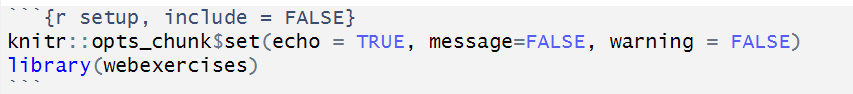
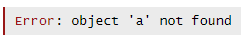
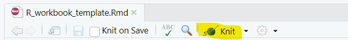

```{r setup, include = FALSE}
knitr::opts_chunk$set(echo = TRUE, message=FALSE, warning = FALSE)
library(webexercises)
```

# Aim

This is a template you can use to create walkthroughs in R. The tool we use here is an Rmarkdown file in which can mix text, code and code output. In this template we demonstrate how to incorporate the following items that are not necessarily standard:

* how to include hidden text or code
* how to build in simple multiple-choice questions
* how to incorporate "FILL-THE-GAP" exercises
* how to hide code

Much of the functionality comes from the [webexercises](https://psyteachr.github.io/webexercises/articles/webexercises.html) package. So before you work on these you will have to install this package in the usual way (say `install.packages("webexercises")` in the Console).

The output will be a html file which you can share with students. Students will not need to have this package installed.

The way how you create the html file is to export or knot it. This document will show at the end how to create these html files. You can also create pdf files, but then you are loosing any interactivity.

The Rmd version of this is available from here: [R_workbook_template.Rmd](https://raw.githubusercontent.com/datasquad/DEE2025_coding/refs/heads/master/R_workbook_template.Rmd).

# Standard Rmarkdown elements that may be useful

The following functionality is standard Rmarkdown notebook functionality (also refer to the [guidance](https://rmarkdown.rstudio.com/))

## Code blocks

The main feature of Rmarkdown notebooks is that you can interlace text/markdown blocks like this one, with code blocks, like the following:

```{r}
library(tidyverse)
library(ggplot2)
library(readxl)
```

In the markdown file you start a code block by "```{r}" and you end it with "```" each of them in their own lines.

A great feature of Rmarkdown files is that you have a lot of control over how code blocks should behave.

### Code block options: echo

This option controls whether the code block should be seen in the resulting html. By default `echo = TRUE`, if you don't want the code to be seen you set `echo = FALSE`. You would start a code block by "```{r, echo = FALSE}"

### Code block options: eval

This controls whether the code in a block should actually be executed. The default is `eval = TRUE`. If you wish to not evaluate a code then you need to begin the code block by "```{r, eval = FALSE}".

### Code block options: message

This controls whether any messages that may be normally printed into the console are displayed in the html file. The default is `message = TRUE`. If you wish to not show any messages then you need to begin the code block by "```{r, message = FALSE}".

### Code block options: warning

This controls whether any warnings that may be normally printed into the console are displayed in the html file. The default is `warning = TRUE`. If you wish to not show any messages then you need to begin the code block by "```{r, warning = FALSE}".

### Code block options: results

This controls whether any output produced by the R code is shown or not. The default is `results = asis`. If you wish to not show any code produced output then you need to begin the code block by "```{r, results = hide}".

### Code block options: include

If you wish nothing to be shown off the code chunk, but you wish it to be evaluated, then you may wish to set the `include` option to `FALSE`.

### Code block options: defaults

At the beginning of your markdown file you should have a code chunk that sets the defaults for your file. This is what we typically set

{width="50%"}

You can see that for this particular chunk we set `include = FALSE` as that chunk itself should not be seen. We also include the `library(webexercise)` in here as a learner need not see this library being loaded. It is only needed to produce the functionality of the worksheet but not for any work students will be doing.

## Weblinks

This is an example of a weblink: [guidance](https://rmarkdown.rstudio.com/).


## Image

You can include images. Make sure that you have the correct path to the image (relative to the directory in which your notebook is stored). It can be useful to create a folder for images.


## Code embedding

You can present code inside the markdown text. You do that when you do not wish to have the code executed. Of course here you can also achieve that by using a code chunk and setting `eval = FALSE`.

``` r
a <- 3
print("This code will not be executed")
```

## LaTeX

You can use LaTeX in you notebooks. If you wish inline mathematics you do that by encaing the maths in dollar signs such as this: $\hat{y} = \hat{\alpha} + \hat{\beta} x$.

If you wish to display a line of mathematics you do that with the begin/end equation command as you would in a tex document:

\begin{equation}
\hat{y} = \hat{\alpha} + \hat{\beta} x
\end{equation}

## Embedding a YouTube video

You can embed a video into your notebook. The way that I could make work is the following bit of code (you could hide the code with the above technique). It requires you to import something from the `IPython.display` package. 

Here 'fPRcu9g7ZTQ' is the unique identifier for the particular video, and you can find it from any YouTube's video. The following video has the following url: "https://youtu.be/fPRcu9g7ZTQ" and the last sequence of letters and numbers is the unique code for the video.

<iframe src="https://www.youtube.com/embed/fPRcu9g7ZTQ" data-external= "1" > </iframe>

# Non-standard workbook elements

You need to look at the "Rmd" version of this workbook to see how these are built. You will find this here [R_workbook_template.Rmd](https://raw.githubusercontent.com/datasquad/DEE2025_coding/refs/heads/master/R_workbook_template.Rmd). 

## Multiple choice questions

The webexercise package allows you to include multiple choice questions into a workbook. These are built straight into the markdown text of your workbook.

Which of the following packages allows you to built multiple choice questions into Rmarkdown worksheets. There are two ways to do that. One where the answer options are presented in a drop-down box:

`r mcq(c("tidyr", "rmarkdown", answer = "webexercises", "tidyverse"))`

When you have longer answer options then you may wish to present answers in the following way.

What is the best interpretation of a p-value?

```{r, echo = FALSE}
opts_p <- c(
   "the probability that the null hypothesis is true",
   answer = "the probability of the observed, or more extreme, data, under the assumption that the null-hypothesis is true",
   "the probability of making an error in your conclusion"
)
```

`r longmcq(opts_p)`

## Fill-in answer questions

You can also ask readers to respond to a question with either a numerical or text input.

What is the function in R with which you can install a package that is not yet installed on your computer?

`r fitb("install.packages")`

You can also allow for multiple correct answers, ignore whether letters are upper or lower case and ignore spaces. For details on how to do that refer to the [webexercises support pages](https://psyteachr.github.io/webexercises/articles/webexercises.html#fill-in-the-blanks).

## True or False questions

The last question type that is implemented in the webexercises package is True or False questions.

Building questions into rmarkdown is easy when using webexercises. `r torf(TRUE)`

## Hidden boxes

Another incredibly useful element introduced by webexercises are hidden boxes. There are different ways to implement them but we find this way the most strightforward one.

`r hide("Click to see why")`

The user can click on the box which will make this text appear. Inside the box you can use all the other elements described before, for instance code chunks

```{r, echo = FALSE}
hist(rnorm(1000))
```

`r unhide()`


# Useful elements for a learner facing workbook

## Showing error messages

Showing error messages is not necessarily straightforward as you cannot built faulty code into your notebook. However, you may want to expose your students to error messages and how to deal with these.

You may have to write faulty code and execute it while you are editing the file, take a screenshot of the error, save that as a "png" file and then display the image like it is done below.You could for instance ask students to run some faulty code in order to produce an error message. When you present the code in a code chunk you should set `eval = FALSE`.

```{r, eval = FALSE}
b <- a - sqrt(56)
```

You should get the following error message.



Then you can give students some guidance on how to use the information in the error to fix the problem.You could do that with advice in a hidden box or perhaps multiple choice giving students different options of action like here:

What is the correct action to fix this issue?

```{r, echo = FALSE}
opts_p2 <- c(
   "the function sqrt has been used incorrectly",
   answer = "there is no object a and it needs to be defined and available in the environment prior to use",
   "R is case sensitive and the code should refer to object A",
   "We are using an incorrect assignment operator and we should use b = ..."
)
```

`r longmcq(opts_p2)`


## Explaining code, helping students read code

As increasingly we will use support tools (Google search, ChatGPT or other LLMs) to write code for us, the skill of actually reading and understanding code will be increasingly important. There are a number of ways how you can support skill development through how you present material in code walkthroughs.

Here is one example.You could start by presenting some code.

```{r}
emdat <- read_excel("natural.xlsx", guess_max = 15000) 
names(emdat) <- make.names(names(emdat))
```

`r hide("What does this line of code do")`

Here you could explain what the code actually does. Here in particular why it is useful here to set the `guess_max` option to a large number. Also you would want to explain why it is useful to apply the `make.names` function to the variable names of `emdat`. Mainly this is done to remove spaces from variable names which makes working in R significantly more straightforward.

`r hide("How can I find this out myself?")`

Here you could provide the reader with tips on how to figure stuff like this out themselves. You could show them how to read the help function, how to search sensibly in Google (use search term "R read_excel guess_max") or how to communicate with ChatGPT ("I am working in R and am using the read_excel function to import an excel datasheet. What are reasons to set the guess_max option to a higher than default value?")

As you can note here you can nest these boxes and you could use this to give readers ever more detailed advice.

`r unhide()`
`r unhide()`

## Complete the blank exercises 

A very useful way to encourage learners to engage learners in the typical activities of a coder is to ask them to complete pieces of incomplete code. You can do that such that learners can eventually see the correct code or in a way that does not reveal the correct code, but does give learners the opportunity to verify that they have done the right thing.

### No solution given

Here we present some incomplete code for students. This is easiest done by using a code chunk but setting `eval = FALSE`. Then you can also add the correct code in a different code chunk but here you set `echo = FALSE`. This means that the correct code is run but not shown (and you will only be able to see that correct code in the "Rmd" version of this file but not in the rendered "html" version). In the correct code you can produce a piece of output that can help the learner evaluate whether they correctly completed the code.

In this example you could ask students to produce some summary statistics for the `No..Homeless` variable in the `emdat` dataframe.

```{r, eval = FALSE}
XXXX(emdat$XXXX)
```

```{r, echo = FALSE}
summary(emdat$No..Homeless)
```

On this occasion the code you asked learners to complete will itself produce the output. But you may need to consider producing an extra line with output to reveal information that allows the learner to verify that they have done the right thing.

### Solution provided

If you do wish to give the correct code you could hide it in a box. As above you could present the problem/task. This could be followed by the following.

`r hide("How can I find this out myself?")`

There are different ways of obtaining summary statistics in R, but the most straightforward one is to use the `summary` function. You can use it as follows:

```{r, eval = FALSE}
summary(emdat$No..Homeless)
```

If you did present the correct result beforehand, as we have done here you will want to set `eval = FALSE` in this code chunk, otherwise you will see the statistics twice.

`r unhide()`

## Advice on how to search for help

Searching for solutions to problems is a super important skill for students to learn. You can give learners a problem and then use nested hidden boxes to give students hints and steps towards a solution.

In nested hidden boxes you could give increasingly detailed advice on how to use either google search of an LLM to get the right support for a particular problem. You could give advice on the right search terms and on how to prompt a LLM. At the end you could even link an interaction with, say, ChatGPT, to illustrate how to ask questions and how to use results. This can be useful to help learners how too formulate a small problem to an LLM on which it can help but then also understand that usually the solution needs adjusting (e.g. this [interaction with ChatGPT](https://chatgpt.com/share/689ba982-0ce0-8010-958a-7dd8e5f5c004) to see how a well formulated query can deliver the solution). 

# Rendering/Exporting the workbook

Once you have drafted your workbook as a "Rmd" file you will have to render or knit it to produce a "html" file which you can share with students. This file can then be shared with and viewed by students (also offline).

The process of knitting the "Rmd" file into a "html" file is very straightforward in RStudio. First you need to ensure that you have saved your latest edits (CTRL + S in Windows). Then you press the knit button as illustrated below. This will place the resulting "html" file into the same directory in which you saved your "rmd" file.

{width="50%"}